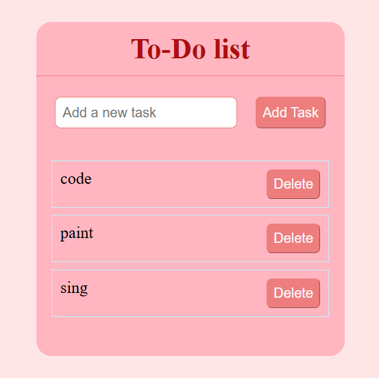

# To-Do List Web App

This project is a simple browser-based **To-Do List application** built using HTML, CSS, and JavaScript. The application allows users to add and manage daily tasks through a clean and minimal user interface.
The goal of this project was to practice core front-end development concepts such as **DOM manipulation, event handling, and interface styling**.

---

## Live Demo

View the deployed application here:
https://yashoda07.github.io/Mini_Projects/todo-app/

---

## Features

- Add new tasks to a list
- Deleting tasks from the list
- Display tasks dynamically on the page  
- Simple and clean user interface  
- Lightweight and responsive layout  
- Runs completely in the browser  

---

## Technologies Used

- HTML5  
- CSS3  
- JavaScript  

---

## Screenshot

---

## Learning Outcomes

Through this project I practiced:
- DOM manipulation in JavaScript  
- Handling user input  
- Structuring front-end projects  
- Deploying static websites using GitHub Pages  
